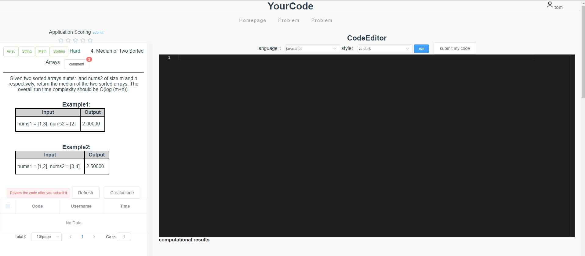

## Project Description

YourCode Website

This project is an online programming website. 
Users can compile and run programming questions online. 
It supports multiple languages such as java, Python, and C++ (added here as needed). 
The website is divided into administrators and ordinary users. Ordinary user account information is managed. Ordinary users can answer programming questions, view answers submitted by other users, and post comments. Ordinary users can also upload custom programming questions.


## Build/Run

- [Node.js](https://nodejs.org) v10.0 

- NPM v6

  

## Run the app

For local development, run the app with:

<font size = 3>Front-end:</font>
```
npm install
```

```
npm run dev
```
or user can install Vue.Js on Intellij, then open the front-end folder, Users can follow the steps in the readme file in the front-end folder.
If you encounter problems installing npm, you can search for solutions on google.

<font size = 3>Back-end:</font>

Create the database myproject with UTF-8 database encoding

Execute the database script, e.g. <font color=red>db/mysql.sql</font> for a MySQL database, to initialise the data

Modify <font color=red>application.properties</font> to change the database account and password

Run the main method of MyspringbootApplication.java to start the project

Project access path: http://localhost:8001

Admin account password: admin/admin1

You can now access the web vault in your browser at `https://localhost:8001`.

You can also manually adjust your API endpoint settings by adding `config/index.js` overriding any of the following values:

```js
module.exports = {
  dev: {

    // Paths
    assetsSubDirectory: 'static',
    assetsPublicPath: '/',
    proxyTable: {},

    // Various Dev Server settings
    host: 'localhost', // can be overwritten by process.env.HOST
    port: 8001, // can be overwritten by process.env.PORT, if port is in use, a free one will be determined
    autoOpenBrowser: false,
    errorOverlay: true,
    notifyOnErrors: true,
    poll: false// https://webpack.js.org/configuration/dev-server/#devserver-watchoptions-
```

Example

1：Login/Sign up


Enter the username and password to log in. 
The administrator account defaults to admin/admin1, which provides the registration function.


2：List of problems


After logging in, users can see the questions in the question bank, view the average score of the questions across all users, and search for different attributes of the questions based on different conditions, such as the difficulty of the question, the type of question, etc.
3：View the details of title.

​   Click on the blue solution in each row of the problem list to go to the details page for that problem



1：Show description of problems, and examples of input and output.

​                           2: User answers to this question.

​                           3: After answering the question, the user can see the author's and other users' answers to the question

​                           4: See what other users have to say about this problems

​                           5: Rate this question.

4：Create problem


Users create problems and can debug them on this page.

5：Ranking


## Future Plan
We will give more rights to admin.

1.Deletion of comments

2.Assign administrator rights to other users

Study:

1.Support users to upload study materials.

2.Searching for questions: currently it is relatively fast when the number of questions is not large, but subsequently the number of questions becomes larger should use Redis or elastic search.

## Acknowledgements

https://github.com/newbee-ltd/newbee-mall-api

https://www.bilibili.com/video/BV12R4y157Be/?spm_id_from=333.337.search-card.all.click&vd_source=7ccaa22641b2029100f298b48c6f2656

https://www.javatpoint.com/spring-boot-tutorial

https://juejin.cn/post/6844903683860201486

https://github.com/sunlightcs/d2-admin-renren-security-enterprise

## Dependencies tool
| Front-end                           |
|-------------------------------------|
| element-ui^2.15.9                   |
| axios^0.27.2                        |
| vue^2.5.2                           |
| vue-axios^3.5.2                     |
| NPM v6                              |
| [Node.js](https://nodejs.org) v10.0 |

JDK1.8

Tomcat8.5+

MySQL8.0

maven3.6+

mybatis-plus3.4.2

springboot2.3.7


